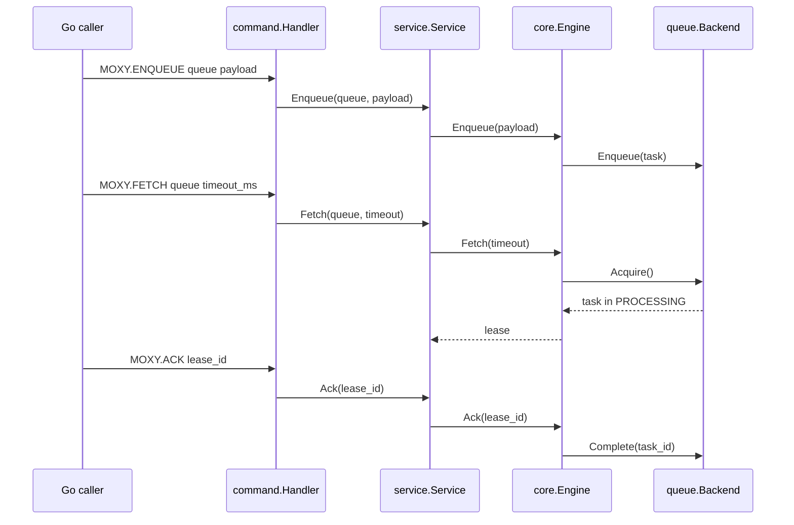

# Moxy Architecture

Moxy is built around one rule: task storage and lease ownership are separate
concerns.

The queue backend owns task placement. The core engine owns temporary ownership
metadata. A task can be ready, processing, completed, or requeued after an expired
lease. A lease can be acknowledged or expire; it is not the task itself.

## Package Map

```text
cmd/moxy
  Small non-interactive demo over the internal command layer.

internal/task
  Defines Task, the shared unit of work.

internal/queue
  Defines Backend and concrete MemoryQueue/RedisQueue implementations.

internal/core
  Coordinates leases for one backend-backed queue.

internal/reaper
  Periodically asks an engine to requeue expired leases.

internal/service
  Manages many named queues by creating one core.Engine per queue.

internal/command
  Protocol-neutral command handler for future TCP/RESP integration.

internal/wal
  Append-only journal of lease transitions, replayed to rebuild lease state.
```

## Data Flow



## Lease Expiration

`core.Engine` keeps an expiration heap keyed by lease ID. The lease map remains the
source of truth. ACK does not remove heap entries directly; stale heap entries are
ignored when reaped.

If a backend requeue fails during expiration recovery, the lease remains active and
the engine schedules a retry one second later. This prevents the task from becoming
stuck without creating an immediate tight retry loop.

## Redis Backend

`RedisQueue` uses Redis lists:

```text
moxy:{queue}:ready
moxy:{queue}:processing
```

Ready tasks are inserted with `LPUSH`; acquire uses `LMOVE RIGHT LEFT`, preserving
FIFO behavior. `Complete` and `Requeue` use Lua scripts to atomically find a task by
ID inside the processing list and remove or move the exact serialized task value.

Serialization is JSON for now. It is intentionally simple and debuggable.

## Reliability Guarantees

Current guarantee:

- Tasks may be delivered more than once.
- Tasks should not silently disappear after a worker fetches them.
- Expired leases return tasks to ready storage.

Lease state survives a restart. Every transition is journalled before the lease
becomes visible, and the journal is replayed on boot, so a lease held when the
process died is reinstated with its original deadline rather than being lost
with the task stuck in processing storage.

Current non-guarantees:

- Recovery covers lease state, not the ready queue itself; the backend owns that
  durability, so a Redis configured to lose writes still loses tasks.
- A task acquired from the backend microseconds before a crash, in the window
  before its journal write lands, is not recovered. It stays in processing
  storage until an operator moves it.
- No snapshots of backend contents.
- No distributed coordination yet.
- No user-facing Redis protocol yet.

Those are future layers. The current priority is making the internal lifecycle
small, testable, and correct.
