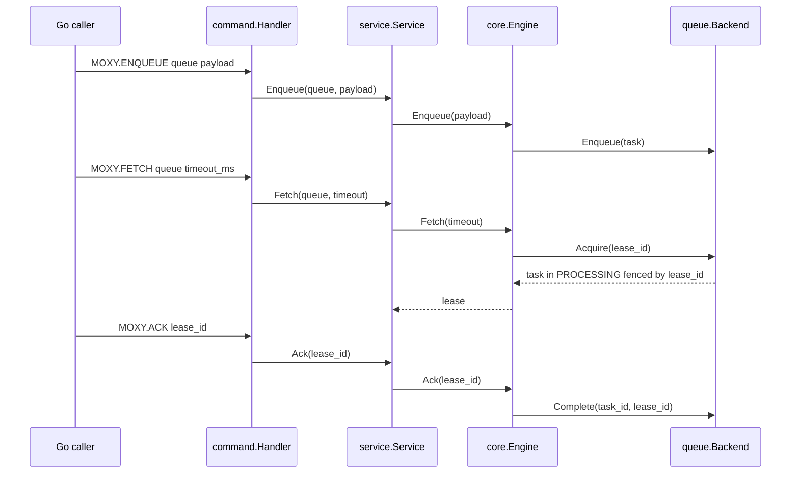

# Moxy Architecture

Moxy is built around one rule: task storage and lease ownership are separate
concerns.

The queue backend owns task placement. The core engine owns temporary ownership
metadata. A task can be ready, processing, completed, or requeued after an expired
lease. A lease can be acknowledged or expire; it is not the task itself.

## Package Map

```text
cmd/moxy
  TCP server over the internal command layer; --backend selects memory or redis.

internal/task
  Defines Task, the shared unit of work.

internal/queue
  Defines Backend and concrete MemoryQueue/RedisQueue implementations.

internal/core
  Coordinates leases for one backend-backed queue.

internal/reaper
  Periodically asks an engine to requeue expired leases.

internal/service
  Manages many named queues by creating one core.Engine per queue.

internal/command
  Protocol-neutral command handler. Knows nothing about RESP or sockets.

internal/resp
  RESP2 reader and writer.

internal/protocol
  Adapts RESP arrays to command.Command and command results back to RESP.

internal/server
  TCP accept loop; one connection reads commands and writes replies.

internal/wal
  Append-only journal of lease transitions, replayed to rebuild lease state.
```

## Data Flow


```mermaid
sequenceDiagram
    participant Client as Go caller
    participant Command as command.Handler
    participant Service as service.Service
    participant Engine as core.Engine
    participant Backend as queue.Backend

    Client->>Command: MOXY.ENQUEUE queue payload
    Command->>Service: Enqueue(queue, payload)
    Service->>Engine: Enqueue(payload)
    Engine->>Backend: Enqueue(task)

    Client->>Command: MOXY.FETCH queue timeout_ms
    Command->>Service: Fetch(queue, timeout)
    Service->>Engine: Fetch(timeout)
    Engine->>Backend: Acquire(lease_id)
    Backend-->>Engine: task in PROCESSING fenced by lease_id
    Engine-->>Service: lease

    Client->>Command: MOXY.ACK lease_id
    Command->>Service: Ack(lease_id)
    Service->>Engine: Ack(lease_id)
    Engine->>Backend: Complete(task_id, lease_id)
```

## Lease Expiration

`core.Engine` keeps an expiration heap keyed by lease ID. The lease map remains the
source of truth. ACK does not remove heap entries directly; stale heap entries are
ignored when reaped.

If a backend requeue or dead-letter fails during expiration recovery before the
backend applies the transition, the lease remains active and the engine schedules
a retry one second later. If the backend already applied the transition but the
close record did not land, the retry observes the missing or mismatched lease
fence, appends `wal.OpStale`, and drops only the old lease.

## Redis Backend

`RedisQueue` uses a ready list, a processing task hash, a processing lease-fence
hash, and a dead-letter list:

```text
moxy:{queue}:ready
moxy:{queue}:processing
moxy:{queue}:processing:leases
moxy:{queue}:dead
```

Ready tasks are inserted with `LPUSH`; acquire uses one Lua script to `RPOP` the
oldest ready task, store the serialized task in `processing`, and store the lease
ID in `processing:leases`. `Complete`, `Requeue`, `DeadLetter`, and startup
reconciliation compare the stored lease ID before mutating either hash.

Serialization is JSON for now. It is intentionally simple and debuggable.

## Reliability Guarantees

Current guarantee:

- Tasks may be delivered more than once.
- Tasks should not silently disappear after a worker fetches them.
- Expired leases return tasks to ready storage.

Lease state survives a restart. Each transition is journalled, the journal is
replayed on boot, and a lease held when the process died is reinstated with its
original deadline. The write order is per operation and the asymmetry carries
the guarantee: `Fetch` generates the lease ID, passes it to backend `Acquire`,
then journals before the lease becomes visible; `Ack` completes in the backend
before it journals. Both orders exist so the crash window falls on the
recoverable side, and which side that is flips at the moment the work is actually
done. `docs/failure-matrix.md` enumerates every boundary; `README.md` has the
short table.

A crash between the backend acquire and a durable fetch record leaves a task in
processing with a lease fence that no WAL record covers. Startup reconciliation
returns exactly those to ready without charging an attempt, and keeps recovered
leases only when both task ID and lease ID match backend processing. Mismatched
WAL leases are closed with `wal.OpStale`. See [ADR 0002](docs/adr/0002-startup-reconciliation-not-write-reordering.md).

Current non-guarantees:

- Recovery covers lease state, not the ready queue itself; the backend owns that
  durability, so a Redis configured to lose writes still loses tasks.
- An append that was written but not fsynced promises nothing. Recovery may find
  the record, a torn record, or none, and only the surviving-record branch
  restores the original deadline.
- At-least-once, not exactly-once. A worker past its deadline can be joined by a
  second one holding the requeued task.
- No snapshots of backend contents.
- No distributed coordination.

The last two are future layers. The current priority is making the internal
lifecycle small, testable, and correct.
