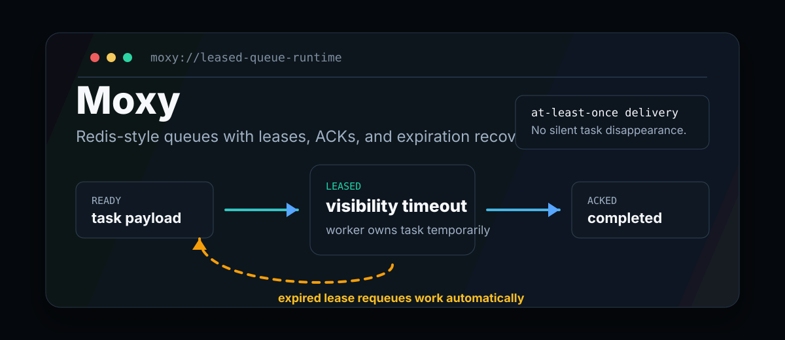
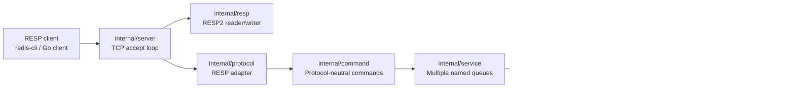

<p align="center">
  
</p>

<p align="center">
  <a href="https://github.com/an8kk/Moxy/actions/workflows/go.yml"></a>
  <a href="https://goreportcard.com/report/github.com/an8kk/Moxy"></a>
  <a href="LICENSE"></a>
  
</p>

# Moxy

Moxy is a reliability layer for Redis-style queues. It adds leases, ACKs,
visibility timeouts, and expiration recovery so tasks do not silently disappear
when a worker dies.

```text
READY -> PROCESSING -> ACKED
READY -> PROCESSING -> EXPIRED -> REQUEUED -> READY
```

Moxy is being built from the inside out: first the correctness model, then the
network/protocol layer, and only later transparent Redis proxying and persistence.
The current repo is already useful as a compact Go reference for reliable queue
internals.

## The Pain

Plain Redis list consumption often starts with `LPOP`. It is fast, simple, and
dangerous:

1. A worker pops a task.
2. The worker crashes before completing it.
3. Redis has already removed the task.
4. The task is gone.

Moxy replaces pop-and-pray delivery with leased delivery. A worker receives a
temporary lease; if it ACKs, the task is completed. If it vanishes, the task is
requeued after the lease expires.

## Standard Redis Lists vs Moxy

| Capability | Standard Redis List Consumer | Moxy |
| --- | --- | --- |
| Worker crash after fetch | Task can disappear | Task remains recoverable |
| Visibility timeout | Build it yourself | Native lease expiration |
| ACK semantics | Build it yourself | `MOXY.ACK lease_id` |
| Expired task recovery | Manual scripts or side tables | Built into the engine |
| Testable core logic | Usually buried in worker code | Dedicated core package |
| Backend choices | Redis list only | MemoryQueue and RedisQueue |
| Protocol status | Redis commands today | RESP command path for Moxy commands |

## 15-Second Recovery Demo

Run the local recovery demo:

```sh
go run ./cmd/moxy-recovery-demo
```

It simulates a worker fetching a task, disappearing before ACK, and the reaper
putting that task back into ready storage.

To render a terminal GIF with [VHS](https://vhs.charm.sh/):

```sh
vhs demo/recovery.tape
```

The tape writes `docs/assets/recovery.gif`.

## What Works Today

- In-memory queue backend with `READY` and `PROCESSING` storage.
- Redis queue backend using `go-redis/v9`.
- Atomic Redis `Complete` and `Requeue` operations with Lua scripts.
- Single-queue lease coordinator in `internal/core`.
- Multi-queue service layer in `internal/service`.
- Protocol-neutral command handler in `internal/command`.
- RESP2 reader/writer in `internal/resp`.
- Redis-compatible TCP command server for Moxy commands and `PING`.
- Background expiration reaper.
- Shared backend contract tests for MemoryQueue and RedisQueue.
- Opt-in Redis integration tests.

## Architecture



`core.Engine` coordinates one queue. `service.Service` owns the map of queue names
to engines. Queue backends own task storage; the core engine owns lease metadata and
expiration scheduling.

See [ARCHITECTURE.md](ARCHITECTURE.md) for the deeper system notes.

## Internal Commands

The command layer is protocol-neutral Go code. The TCP/RESP server translates
wire input into these commands and translates command responses back to RESP.

```text
MOXY.ENQUEUE queue payload
MOXY.FETCH queue timeout_ms
MOXY.ACK lease_id
MOXY.STATS queue
```

Example:

```go
svc := service.New(func(queueName string) queue.Backend {
	return queue.NewMemoryQueue()
})
handler := command.NewHandler(svc)

enqueue, _ := handler.Handle(command.Command{
	Name: command.EnqueueName,
	Args: []string{"emails", "send welcome email"},
})

fetch, _ := handler.Handle(command.Command{
	Name: command.FetchName,
	Args: []string{"emails", "30000"},
})

_, _ = handler.Handle(command.Command{
	Name: command.AckName,
	Args: []string{fetch.LeaseID},
})

_ = enqueue
```

## Backends

### MemoryQueue

`MemoryQueue` is the default backend used by `core.NewEngine` and the demo binary.
It is deterministic, easy to test, and useful for validating lease behavior.

### RedisQueue

`RedisQueue` stores ready and processing tasks in Redis lists:

- `moxy:{queue}:ready`
- `moxy:{queue}:processing`

`Acquire` uses `LMOVE ready processing RIGHT LEFT`. `Complete` and `Requeue` use Lua
scripts so finding a task by ID and removing or moving it happens atomically inside
Redis.

```go
client := redis.NewClient(&redis.Options{Addr: "localhost:6379"})
backend := queue.NewRedisQueue(client, "emails")
```

## Quickstart

```sh
go test ./...
go run ./cmd/moxy --addr 127.0.0.1:6380 --backend memory
go run ./cmd/moxy-recovery-demo
```

## Running Moxy TCP Server

Memory backend:

```sh
go run ./cmd/moxy --addr 127.0.0.1:6380 --backend memory
```

Redis backend:

```sh
go run ./cmd/moxy --addr 127.0.0.1:6380 --backend redis --redis-addr localhost:6379
```

Testing with `redis-cli`:

```sh
redis-cli -p 6380 PING
redis-cli -p 6380 MOXY.ENQUEUE jobs hello
redis-cli -p 6380 MOXY.FETCH jobs 30000
redis-cli -p 6380 MOXY.ACK <lease_id>
redis-cli -p 6380 MOXY.STATS jobs
```

`MOXY.FETCH` returns a null bulk string when the named queue has no ready task.
That makes an empty queue a normal condition instead of a server failure.

This is not full Redis proxying yet. Only `PING` and `MOXY.*` commands are
supported. Normal Redis commands such as `GET`, `SET`, and `INCR` are not passed
through to Redis in this phase.

## Redis Integration Tests

Redis tests are opt-in so normal development does not require a running Redis
server.

PowerShell:

```powershell
$env:MOXY_REDIS_INTEGRATION='1'
$env:MOXY_REDIS_ADDR='localhost:6379'
go test ./internal/queue -run Redis -count=1 -v
go test ./internal/core -run Redis -count=1 -v
```

Shell:

```sh
MOXY_REDIS_INTEGRATION=1 MOXY_REDIS_ADDR=localhost:6379 \
  go test ./internal/queue -run Redis -count=1 -v
```

## Development Checks

```sh
go mod tidy
go test ./...
go vet ./...
go test ./internal/core -count=100
go test ./internal/queue -count=100
go test ./internal/service -count=100
go test ./internal/command -count=100
go test ./internal/resp -count=100
go test ./internal/protocol -count=100
go test ./internal/server -count=100
```

Race testing is deferred until the local Windows development environment has
cgo/GCC available.

## Non-Goals For This Phase

Moxy is still single-node and backend-adapter based. These are intentionally not
implemented yet:

- Transparent Redis proxying
- Full Redis command pass-through
- WAL
- snapshots
- crash recovery
- Redis Streams
- distributed coordination
- user-facing network protocol commands

## Roadmap

- Keep hardening the command/service boundary.
- Add observability-friendly stats and structured errors.
- Add transparent Redis pass-through after the Moxy command path stays boring.
- Add persistence and crash recovery after the in-memory semantics remain boring.

## License

Moxy is released under the [MIT License](LICENSE).

The boring part is the point: a queue reliability layer should be legible,
testable, and conservative before it becomes networked.
