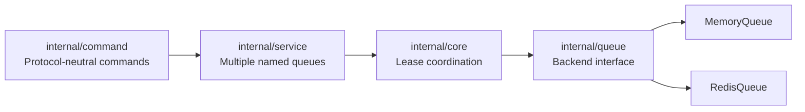

# Moxy

[](https://github.com/an8kk/Moxy/actions/workflows/go.yml)

Moxy is a reliability layer for Redis-style queues. It turns fragile pop-and-forget
delivery into leased, acknowledged, at-least-once delivery:

```text
READY -> PROCESSING -> ACKED
READY -> PROCESSING -> EXPIRED -> REQUEUED -> READY
```

The project is intentionally being built from the inside out. The current codebase
does not proxy Redis traffic yet; it first establishes the core correctness model:
tasks are either ready, processing, or completed, and expired leases return work to
the ready queue instead of letting it disappear.

## Why Moxy Exists

Plain queue consumption with `LPOP` can lose work:

1. A worker pops a task.
2. The worker crashes before completing it.
3. Redis has already removed the task.
4. The task silently disappears.

Moxy prevents that class of loss by separating task storage from lease ownership.
Workers fetch a lease, acknowledge it when the task is done, and the reaper returns
expired leases back to ready storage.

## What Works Today

- In-memory queue backend with `READY` and `PROCESSING` storage.
- Redis queue backend using `go-redis/v9`.
- Atomic Redis `Complete` and `Requeue` operations with Lua scripts.
- Single-queue lease coordinator in `internal/core`.
- Multi-queue service layer in `internal/service`.
- Protocol-neutral command handler in `internal/command`.
- Background expiration reaper.
- Shared backend contract tests for MemoryQueue and RedisQueue.
- Opt-in Redis integration tests.

## Architecture



`core.Engine` deliberately coordinates one queue. `service.Service` owns the map of
queue names to engines. Queue backends own task storage; the core engine owns lease
metadata and expiration scheduling.

See [ARCHITECTURE.md](ARCHITECTURE.md) for more detail.

## Internal Commands

The command layer is a Go API, not a network protocol. It exists so the eventual
TCP/RESP layer can be thin.

Supported commands:

```text
MOXY.ENQUEUE queue payload
MOXY.FETCH queue timeout_ms
MOXY.ACK lease_id
MOXY.STATS queue
```

Example flow:

```go
svc := service.New(func(queueName string) queue.Backend {
	return queue.NewMemoryQueue()
})
handler := command.NewHandler(svc)

enqueue, _ := handler.Handle(command.Command{
	Name: "MOXY.ENQUEUE",
	Args: []string{"emails", "send welcome email"},
})

fetch, _ := handler.Handle(command.Command{
	Name: "MOXY.FETCH",
	Args: []string{"emails", "30000"},
})

_, _ = handler.Handle(command.Command{
	Name: "MOXY.ACK",
	Args: []string{fetch.LeaseID},
})

_ = enqueue
```

## Backends

### MemoryQueue

`MemoryQueue` is the default backend used by `core.NewEngine` and the demo binary.
It is deterministic, easy to test, and useful for validating lease behavior.

### RedisQueue

`RedisQueue` stores ready and processing tasks in Redis lists:

- `moxy:{queue}:ready`
- `moxy:{queue}:processing`

`Acquire` uses `LMOVE ready processing RIGHT LEFT`. `Complete` and `Requeue` use Lua
scripts so finding a task by ID and removing or moving it happens atomically inside
Redis.

```go
client := redis.NewClient(&redis.Options{Addr: "localhost:6379"})
backend := queue.NewRedisQueue(client, "emails")
```

## Quickstart

```sh
go test ./...
go run ./cmd/moxy
```

The demo runs a short command-layer scenario with `MemoryQueue`.

## Redis Integration Tests

Redis tests are opt-in so normal development does not require a running Redis
server.

PowerShell:

```powershell
$env:MOXY_REDIS_INTEGRATION='1'
$env:MOXY_REDIS_ADDR='localhost:6379'
go test ./internal/queue -run Redis -count=1 -v
go test ./internal/core -run Redis -count=1 -v
```

Shell:

```sh
MOXY_REDIS_INTEGRATION=1 MOXY_REDIS_ADDR=localhost:6379 \
  go test ./internal/queue -run Redis -count=1 -v
```

## Development Checks

```sh
go mod tidy
go test ./...
go vet ./...
go test ./internal/core -count=100
go test ./internal/queue -count=100
go test ./internal/service -count=100
go test ./internal/command -count=100
```

Race testing is deferred until the local Windows development environment has
cgo/GCC available.

## License

Moxy is released under the [MIT License](LICENSE).

## Non-Goals For This Phase

Moxy is still single-node and backend-adapter based. The following are intentionally
not implemented yet:

- TCP server
- RESP parser
- Redis proxying
- WAL
- snapshots
- crash recovery
- Redis Streams
- distributed coordination
- user-facing network protocol commands

## Roadmap

- Keep hardening the command/service boundary.
- Add observability-friendly stats and structured errors.
- Introduce TCP/RESP once the internal command model is stable.
- Add persistence and crash recovery after the in-memory semantics remain boring.

The boring part is the point: a queue reliability layer should be legible,
testable, and conservative before it becomes networked.
